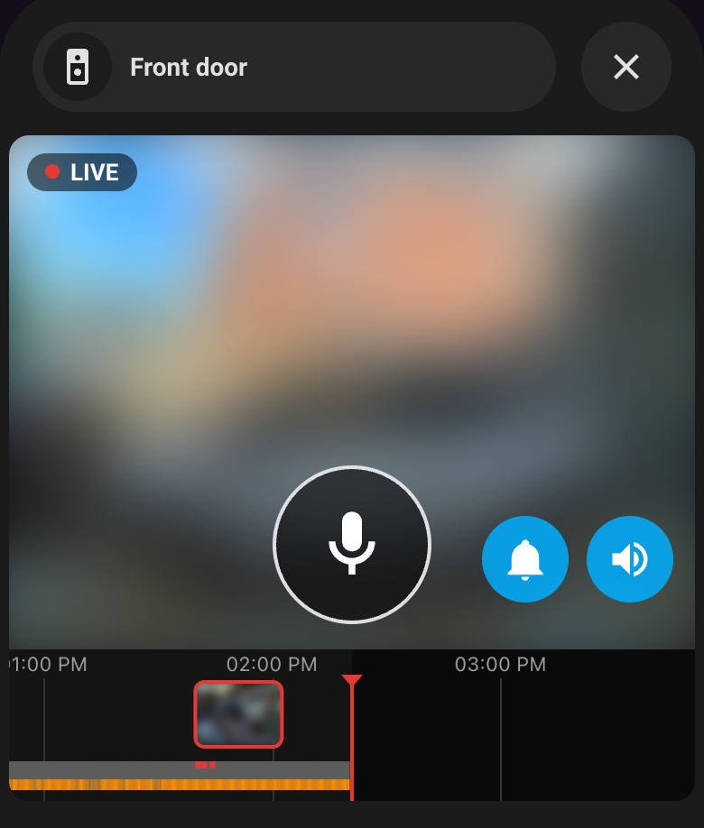
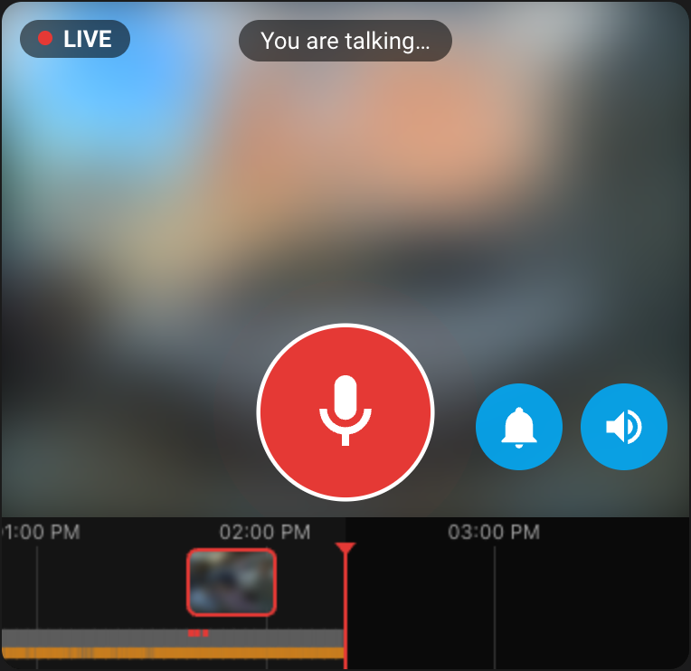
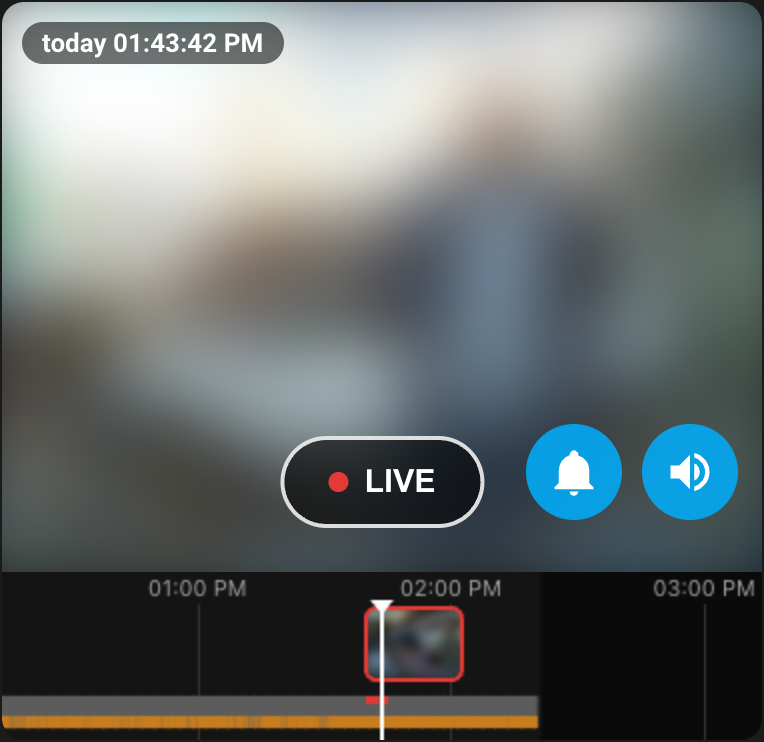

# Frigate Doorbell Card

A Home Assistant dashboard card for doorbells (and other cameras) in [Frigate](https://frigate.video):

- **Live view** with sound (WebRTC via go2rtc), automatic reconnect when the stream drops or freezes
- **Push-to-talk**: hold the microphone button to talk through the doorbell's speaker (two-way audio)
- **Timeline** like a Ring doorbell: drag to scrub, tap a thumbnail to jump to an event, pinch/scroll to zoom
- **Playback** of Frigate recordings with sound, the timeline follows along
- **Chime button** (optional): turn the doorbell chime on/off, e.g. when the baby is asleep
- Works on iPhone (sound starts immediately), Safari, Chrome; light and dark mode; Dutch and English

<p align="center">
  
  
  
</p>
<p align="center"><sub>Live in a pop-up · holding the button to talk · playing back an event from the timeline
(camera image blurred for privacy)</sub></p>

Everything goes through the **Frigate integration** in Home Assistant with your own HA login:
no extra proxies, ports or tokens.

## Requirements

1. [Frigate](https://frigate.video) 0.14+ (tested with 0.18), standalone or as add-on
2. The [Frigate integration](https://github.com/blakeblackshear/frigate-hass-integration) in Home Assistant (with MQTT)
3. For **push-to-talk**:
   - a camera with two-way audio that go2rtc can use (see *Frigate configuration* below)
   - Home Assistant opened over **https** (browsers only allow the microphone on secure connections)

## Installation

### HACS (recommended)

1. HACS → ⋮ → *Custom repositories* → add `https://github.com/versluis-org/frigate-doorbell-card`, type *Dashboard*
2. Install **Frigate Doorbell Card** and reload the browser

### Manual

Copy `frigate-doorbell-card.js` to `/config/www/` and add `/local/frigate-doorbell-card.js` as a
JavaScript module resource (Settings → Dashboards → ⋮ → Resources).

## Configuration

Only the camera is required; everything else is detected automatically.

```yaml
type: custom:frigate-doorbell-card
camera: camera.front_door
```

All options:

| Option | Default | Description |
|---|---|---|
| `camera` | *(required)* | A camera entity from the Frigate integration |
| `chime` | auto-detected | `number` entity for the chime volume (e.g. Reolink `number.…_chime_volume`); `false` hides the button |
| `chime_volume` | entity maximum | Volume used when turning the chime on |
| `history_days` | `7` | How far back the timeline goes |
| `timeline` | `true` | Show the timeline |
| `microphone` | `true` | Show the push-to-talk button |
| `frigate_camera` | from entity | Camera name in Frigate, only if it differs |
| `frigate_client_id` | from entity | Frigate instance, only with multiple Frigate servers |
| `debug` | `false` | Log diagnostics to the browser console |

The card has a visual editor as well.

### What is detected automatically

| | From |
|---|---|
| Frigate instance and camera name | the camera entity (`client_id`, `camera_name`) |
| Aspect ratio | the video itself |
| Two-way audio available | go2rtc's answer when connecting; without it the microphone button is hidden with an explanation |
| Microphone allowed | https or not; without it the button is hidden with an explanation |
| Chime | exactly one `number.*chime*volume` entity |

## As a pop-up

The card works well in a pop-up, e.g. with [Bubble Card](https://github.com/Clooos/Bubble-Card): a button on your
dashboard opens the doorbell, and the stream (and microphone) only run while the pop-up is open.

```yaml
type: custom:bubble-card
card_type: pop-up
hash: '#doorbell'
name: Front door
icon: mdi:doorbell-video
# less padding left/right so the picture is as large as possible
styles: |
  .bubble-pop-up-container { padding-left: 4px !important; padding-right: 4px !important; }
cards:
  - type: custom:frigate-doorbell-card
    camera: camera.front_door
```

Open it from any button with `tap_action: { action: navigate, navigation_path: '#doorbell' }`, or automatically
when someone rings (e.g. with [browser_mod](https://github.com/thomasloven/hass-browser_mod)).

The card pauses itself when it isn't visible (closed pop-up, other tab, scrolled away) and reconnects when it
becomes visible again.

## Frigate configuration

The card uses what Frigate already provides. These parts matter:

```yaml
mqtt:
  enabled: true
  host: <mqtt broker>

go2rtc:
  streams:
    front_door:                                 # same name as the camera below
      # picture + sound; audio as Opus because browsers can't play AAC over WebRTC
      - "ffmpeg:http://<doorbell-ip>/flv?port=1935&app=bcs&stream=channel0_main.bcs&user=admin&password={FRIGATE_DOORBELL_PASSWORD}#video=copy#audio=opus"
      # two-way audio: an RTSP source with an ONVIF backchannel (Reolink: Preview_01_main).
      # go2rtc only uses it for the audio *to* the doorbell.
      - "rtsp://admin:{FRIGATE_DOORBELL_PASSWORD}@<doorbell-ip>/Preview_01_main"
  webrtc:
    candidates:
      - <frigate-lan-ip>:8555                   # browsers connect here for WebRTC
      - stun:8555                               # only needed for live view from outside

record:
  enabled: true
  motion:
    days: 1                                     # recordings with motion (grey/orange in the timeline)
  alerts:
    retain:
      days: 7                                   # alerts (red in the timeline)
      mode: active_objects
  detections:
    retain:
      days: 7
      mode: active_objects

snapshots:
  enabled: true                                 # thumbnails in the timeline

cameras:
  front_door:
    ffmpeg:
      inputs:
        - path: rtsp://127.0.0.1:8554/front_door
          input_args: preset-rtsp-restream
          roles: [record, audio]                # recordings with sound
    live:
      streams:
        front_door: front_door
```

`{FRIGATE_…}` placeholders are replaced by Frigate with environment variables starting with `FRIGATE_`,
so passwords don't have to be in the config file.

| Setting | Without it |
|---|---|
| RTSP source with backchannel in the go2rtc stream | no push-to-talk (button hidden) |
| `#audio=opus` | live view without sound |
| `roles: [record, audio]` | playback without sound |
| `record` (motion/alerts/detections) | empty timeline |
| `snapshots.enabled` | timeline without thumbnails |
| `webrtc.candidates` | no live view |

**Does my camera have two-way audio?** Send an RTSP `DESCRIBE` with the header
`Require: www.onvif.org/ver20/backchannel`; if the answer contains an `m=audio … a=sendonly` section, it does.
Once someone is watching, go2rtc's `/api/streams?src=<camera>` shows `audio, sendonly, PCMU/8000`
for the RTSP producer.

## Notes

- **Live view from outside your home**: the video goes directly between browser and go2rtc (WebRTC).
  That works on your LAN and over VPN; from the internet it needs go2rtc's port 8555 to be reachable.
- **iPhone**: sound starts immediately because the card unlocks audio on your first tap in Home Assistant.
- Playback uses the browser's own HLS player on Safari/iOS and [hls.js](https://github.com/video-dev/hls.js) elsewhere
  (loaded from cdnjs when needed).

## License

MIT
